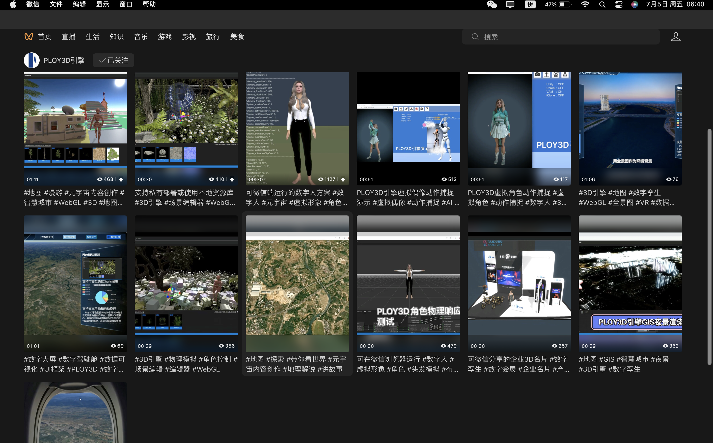
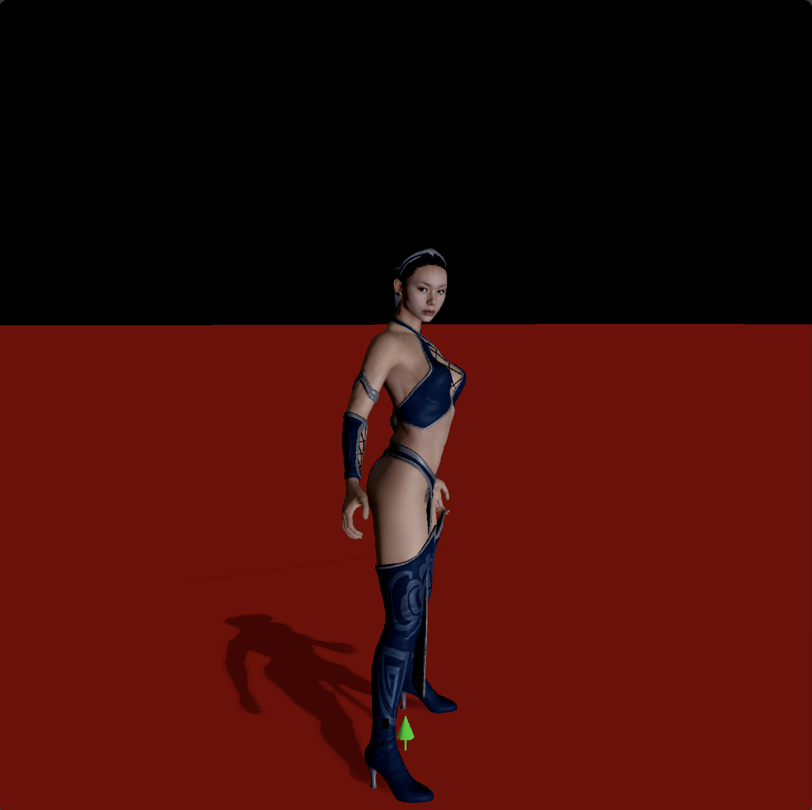
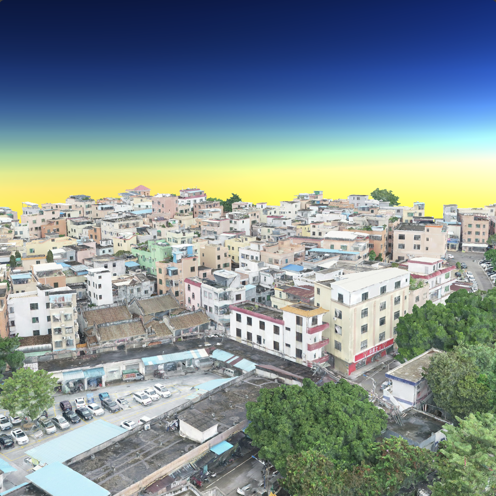
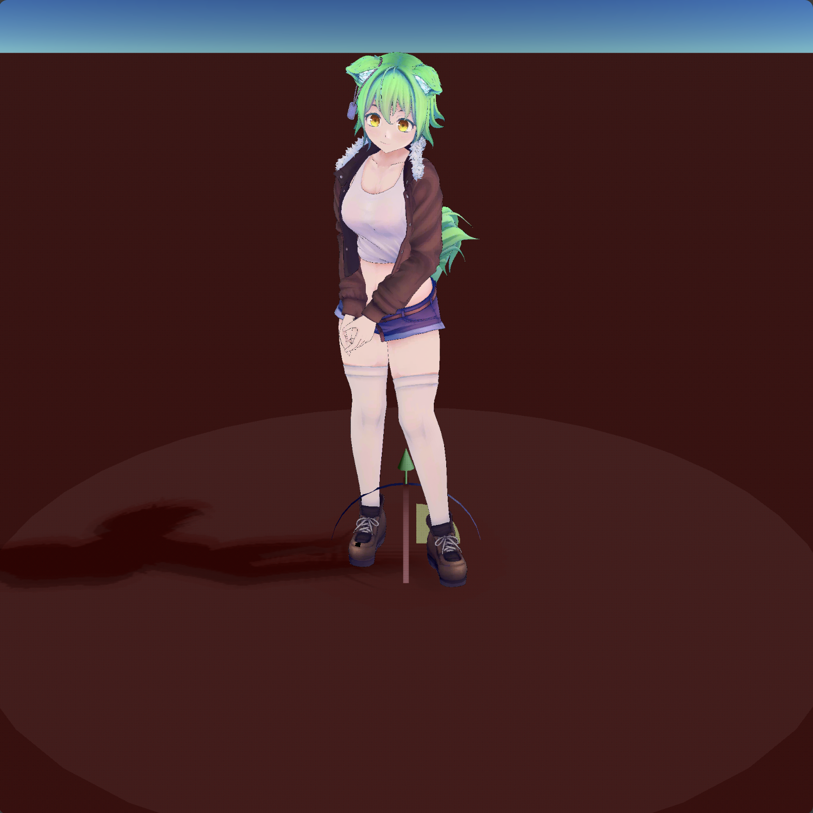
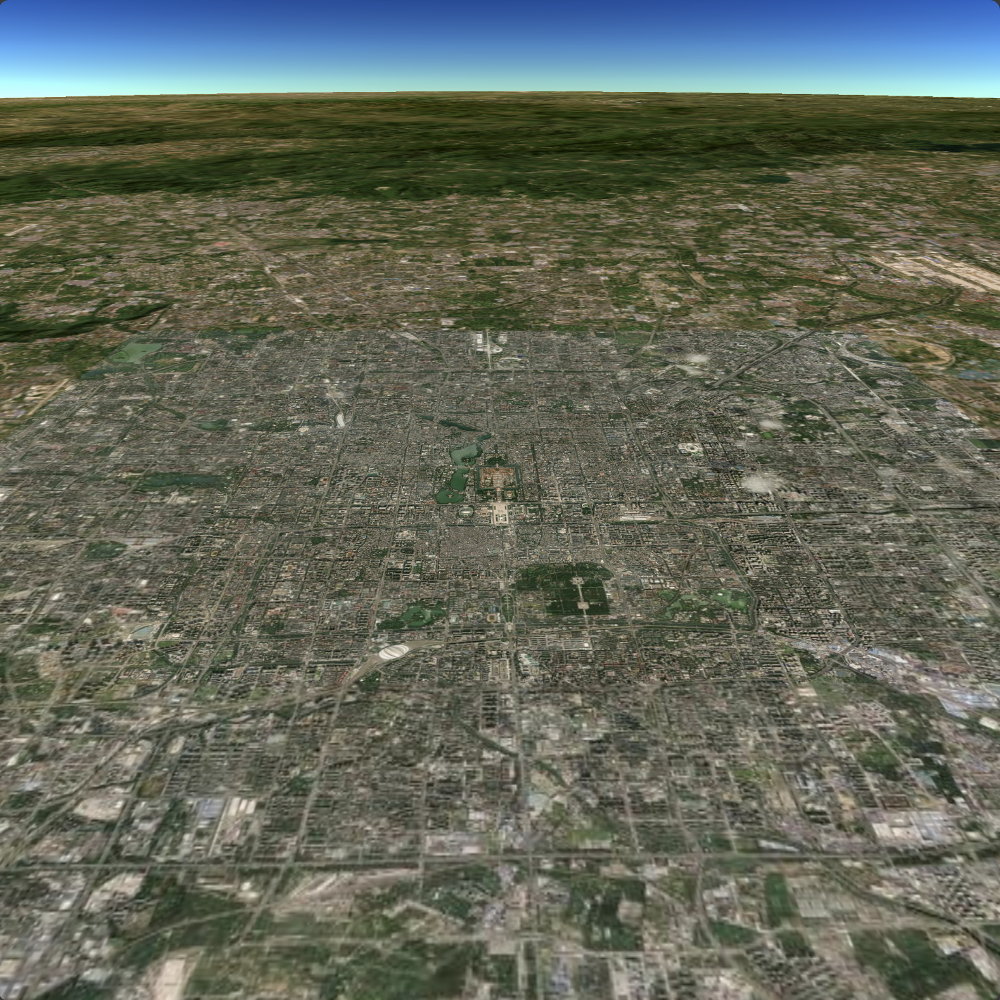

# PLOY3D 引擎概述

Ploy3D是一个基于JavaScript、WebAssembly、WebGPU的国产自研3D引擎。可以在[Deno运行时](https://www.denojs.cn/)下作为本机应用运行，也可以在[支持WebGPU的浏览器](https://caniuse.com/?search=webgpu)环境下运行。当然，在不支持WebGPU的浏览器环境下（如移动端微信），Ploy3D可降级为WebGL2.0运行。

#### Ploy3D包含以下模块：
* 一个以WebAssembly内核为支撑的WebGPU渲染引擎；
* 一个支持在VR模式下使用、支持动态可交互图表[ECharts](https://echarts.apache.org/examples/zh/index.html)的UI框架；
* 一个用于着色器、脚本开发的节点编辑器，也可称为Ploy3D的蓝图系统，因此Ploy3D支持进行0代码开发；
* 一个低耦合的场景编辑器模块，即使在客户端也可以随时调出编辑器界面，以此我们可以轻松开发并交付带有场景编辑搭建功能的3D应用；
* 一个以资源包为主体，以文件夹结构进行组织的资源管理模块，可以轻松搭建私有的本地或云端资源库；
* 一个综合性的数字人解决方案；
* 一个以低耦合方式集成的[PhysX](https://github.com/fabmax/physx-js-webidl)物理引擎；
* 内置GIS、倾斜摄影模型、正射影像、全景图等各种“智慧应用”常用的功能模块，并支持各种融合展示模式；
* 内置对GLTF、DAZ3D、VAM得资源格式的直接支持；



#### 样例体验（联系我，微信号：Miaokit）

| 预览 | 链接 | 预览 | 链接 |
|:------:|:------:|:------:|:------:|
|  | [角色渲染](https://www.ploycloud.com/ploy3d/?sdk=b1_23&appid=meta_human) |   | [倾斜摄影模型](https://www.ploycloud.com/ploy3d/?sdk=b1_23&appid=dior_base) |
|  | [骨骼蒙皮动画](https://www.ploycloud.com/ploy3d/?sdk=b1_23&appid=gltf_skin_anim) |   | [GIS地图](https://www.ploycloud.com/ploy3d/?sdk=b1_23&appid=gis_base) |
|  |  |   | [GIS+倾斜摄影模型](https://www.ploycloud.com/ploy3d/?sdk=b1_23&appid=gis_dior) |

#### 选择Ploy3D的优势:
* 有别于Unity3D引擎使用C#开发、将.NET运行时打包为WebAssembly以在浏览器上运行，Ploy3D是直接基于JavaScript、WebAssembly、WebGPU开发的原生Web3D引擎。Ploy3D具有体量更轻、内存利用率更高、开箱即用、更易于与Web应用集成等优势。Web前端工程师基于一套技术即可完成项目开发，同时依托Deno运行时，我们可以发布本机应用。
* ThreeJS是一个纯JavaScript开发的，适用于各种浏览器平台的通用3D图形库，其封装级别较低，要开发复杂的上层应用需要付出更多的工作。Ploy3D采用了类似于Unity的“ECS”设计模式，API的设计与Unity相近，同时也提供了很多低阶API让开发者完全掌控场景管理和渲染管线设计。
* 相较Unity3D、JavaScript，Ploy3D依托WebAssembly模块完全掌握了内存管理权，没有了运行时的GC，开发者可以精确地知悉和控制内存在何时分配和回收，因此开发者能更自信地在Web平台设计大型3D场景。
* Ploy3D的实现目标不仅是一个通用的3D引擎，更是一个元宇宙应用开发平台，所以我们提供了很多并且会不断扩充的应用功能集。比如针对数据可视化应用，我们提供了可在VR模式下使用，支持动态ECharts图表的3DUI框架；针对3D设计应用（比如VR家装软件、VR园林设计软件），我们提供了一个低耦合的场景编辑功能集；针对智慧城市等“数字”应用，我们提供了3DGIS、倾斜摄影模型、正射影像、全景图等功能集；针对AI数字人应用，我们提供了一个综合性的数字人解决方案，并且内嵌了对DAZ3D、VAM资源的直接支持。另外我们开放了所有资源文件格式规范和资源库设计，用户可以轻松搭建私有的本地或云端资源平台。如果您恰巧想开发上面这些应用由不知从何着手，Ploy3D是您更好的选择。

#### 开源说明：
* 本项目是Ploy3D闭源项目的开源重构版本，现有功能预计于2024年10月完成重构并开源，之后以此开源项目作为主线继续开发。
* 本项目由个人独立开发，创业阶段，提供有偿的技术支持和定制外包服务。
* 为了使项目能否长远发展，我们需要资金的支持，因此我们不得不选择暂时对PLOYCLOUD内核闭源（主要是一些数据结构和算法、内存管理等）。我们始终给予您在保留Ploy3D的LOGO和商标清晰展示的前提下，免费自由使用本软件的权利。如果您需要在项目中移除Ploy3D的品牌展示，请联系作者获取项目独享的商业授权（1万元/项目）。

#### 协议：
本存储库代码基于MIT协议开源。注意，项目依赖的[PLOYCLOUD]()内核为商业软件，请在同意其有关[使用条款]()的前提下使用。

#### 本机开发环境准备
* 安装[Node.js v20.14.0(LTS)](https://nodejs.org/en)开发环境；
* 安装[Deno](https://deno.com/)运行时；
```
MacOS : curl -fsSL https://deno.land/install.sh | sh
Linux : curl -fsSL https://deno.land/install.sh | sh
Windows : irm https://deno.land/install.ps1 | iex
```
* 安装[SDL2](https://deno.land/x/sdl2)动态库，[下载Windows DLL版本](https://github.com/libsdl-org/SDL/releases)（我们已内置包含了64位DLL）；
```
MacOS : brew install sdl2
Linux : sudo apt install libsdl2-dev
```
* 准备或更新sdl2.d.ts文件
```
git clone https://github.com/littledivy/deno_sdl2
tsc --declaration true --emitDeclarationOnly true sdl2.ts
```
* 拉取[Ploy3D]()源码，进入源码根目录（如果修改了我们的引擎源码，按以下方法重新编译）
```
# 1、必要时清除外部依赖缓存（请手动删除Deno缓存目录）
deno info
npm cache clean --force

# 2、输出引擎ES6模块的js文件（输出到./dist/esm/路径）
tsc -p ./

# 3、输出引擎ES6模块的.d.ts文件（输出到./dist/esm/路径）
tsc --declaration true --emitDeclarationOnly true --removeComments false -p ./tsconfig.json
```
* 本机启动
```
deno run --allow-env --allow-read --allow-write --allow-net --allow-ffi --unstable-ffi --unstable-webgpu --unstable-sloppy-imports ./native.js
```
* 生成新字体 [生成工具](https://github.com/Chlumsky/msdf-atlas-gen)
```
msdf-atlas-gen -font simhei.ttf -charset chinese.txt -format png -imageout simhei.png -json simhei.json
```
* 生成环境高光反射贴图和漫反射球谐系数
```
# 不能直接使用HDR贴图直接压缩生成MIPMAP，原理是不同的
# 使用我们定制修改的CMGEN工具生成，会同步生成球谐系数文件
# 生成后使用PVRTexTool压缩为我们引擎支持的BASISU ETC1S UINT SRGB KTX2格式
# 压缩时不要勾选Generate MIPMaps，工具会在原MIPMaps各级内容上压缩
# 我们修改了cmgen的源码实现，使--format=ktx时，默认使用equirect投影而非cube的投影
cmgen --type=equirect --format=ktx --size=1024 --deploy=.\noon_grass_2k .\noon_grass_2k.hdr

# 单独生成球谐系数
cmgen --sh-shader --sh-irradiance --sh-output=sh.txt color_box.hdr
```

#### 坐标系说明：
笛卡尔坐标系：使用X轴朝右，Y轴朝上，Z轴朝外的右手坐标系（与WebGL，ThreeJS，Filament相同）；  
相机观察方向：默认状态下相机朝屏幕里观察对象，所以观察向量为相机空间Z-方向。  
模型坐标系：与笛卡尔坐标系一样采样右手坐标系（与GLTF相同），左手坐标系模型导入时须转换为右手坐标系；  
切线空间：与笛卡尔坐标系一样采样右手坐标系（主流选择）；  
NDC空间（WebGPU）：使用X轴朝右，Y轴朝上，Z轴朝里的左手坐标系。左下角[-1, -1]，右上角[1, 1]，Z值范围[0, 1]。  
> NDC空间中，Z值近0远1，Z数值大部分精度范围被用在靠近相机近的部分。翻转Z轴后，Z轴朝外（变成右手坐标系，WebGL）；  
> NDC空间（WebGL）：使用X轴朝右，Y轴朝上，Z轴朝外的右手坐标系。左下角[-1, -1]，右上角[1, 1]，Z值范围[-1, 1]。  
> 引擎所用相机->裁剪变换矩阵，裁剪空间Z值范围[近1, 远0]，在WebGL着色器中需要将Z值转换为[近1, 远-1]。  

图像空间（WebGPU，视窗画布、帧缓存、视口、纹理采样）Y轴向下，左上角(0, 0)，(0, 0)为纹理内存最低地址；  
空间下标：世界空间<sub>w</sub>，观察空间<sub>v</sub>，裁剪空间<sub>c</sub>，NDC空间<sub>n</sub>  

#### 参考文档
* [WebGPU API](https://developer.mozilla.org/zh-CN/docs/Web/API/WebGPU_API)
* [WebGPU Examples](https://webgpu.github.io/webgpu-samples/)
* [Deno WebGPU Examples](https://github.com/denoland/webgpu-examples)
* [Deno .d.ts](https://github.com/denoland/deno/tree/main/cli/tsc/dts)
* [CanvasKit](https://skia.org/docs/user/modules/quickstart/)
* [ECharts](https://echarts.apache.org/examples/zh/index.html)
* https://webgpufundamentals.org/webgpu/lessons/webgpu-wgsl-function-reference.html
* https://www.w3.org/TR/webgpu/
* https://gpuweb.github.io/gpuweb/wgsl/
