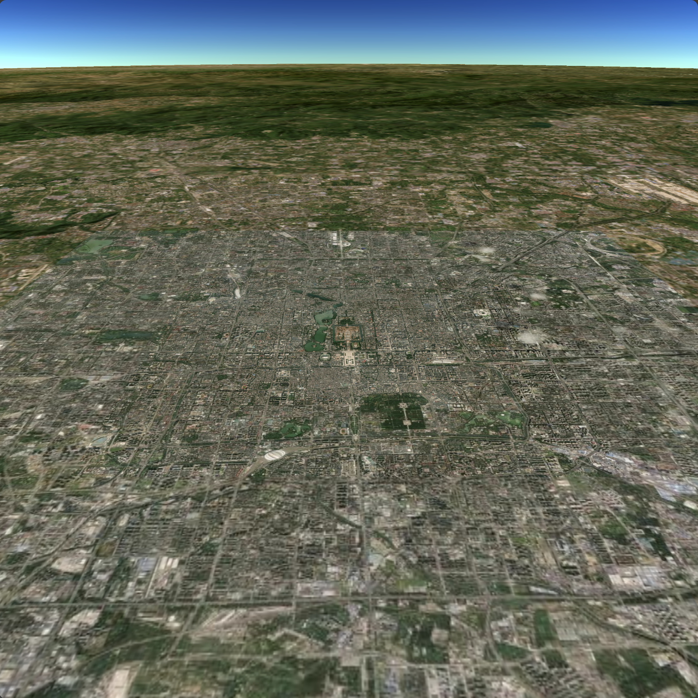

# PLOY3D 引擎概述

[Ploy3D](https://gitee.com/miaokit/ploy3d) 是一个基于JavaScript、WebAssembly、WebGPU的国产自研3D引擎。可以在[Deno运行时](https://www.denojs.cn/)下作为本机应用运行，也可以在[支持WebGPU的浏览器](https://caniuse.com/?search=webgpu)环境下运行。当然，在不支持WebGPU的浏览器环境下（如移动端微信），Ploy3D将来可降级为WebGL2.0运行。

Ploy3D开源项目建立三个月有余，更新说明：

1. 引擎API定义基本稳定；
2. 应用开发框架基本稳定，支持在URL中指定SDK版本、应用ID等，便于应用部署于更新；
3. 内存和资源管理趋于稳健，可实时统计各种资源开销，提供安全退出接口在退出前释放所有资源，以便及时发现代码疏漏；
4. 资源包和资源格式设计完善，资源包可位于内存、本地文件夹或者云端，所有资源访问基于URI，无需下载就可访问云端共享资源；
5. 资源包资源缩略图快捷生成，每个资源包包含注册信息，UI菜单信息和实际资源路径等；
6. 实现了基本的2D图形渲染器，接口兼容Canvas，文本绘制等；
7. 4K分辨率支持、动态分辨率支持；
8. 简单灵活的渲染管线自定义，并且可以运行时动态调整、渲染管线是基于帧通道的编排；
9. 内置预定义渲染管线完善，支持包括Cascaded Shadow Maps、集群动态光照、SSAO、SSR、SSS、BLOOM等；
10. 完全自由灵活的着色器开发框架、未来兼容着色器节点图，内置PBR着色器等；
11. 引入效果体积组件管理不同区域不同时间的渲染设置；
12. 场景文件等同于资源包，可同时装载和渲染无限个场景并进行交互，因此可分布式进行大世界场景搭建；
13. 场景将可注册到GIS上，在浏览GIS时动态装载过滤场景，因此可以在世界各地搭建3D空间并实时更新并相互共享；
14. 完善GIS实现，3D对象可定位于GIS上任意经纬度，可实时查看GIS任意经纬度空间，查看远近和角度完全自由控制，我们抹除了3D空间与GIS空间之间的差异；
15. 支持无限个倾斜摄影模型的装载和绘制，并且能与GIS完美匹配，GIS支持行政区域矢量图形的填充和描边绘制；
16. 完善多线程实现、能让我们云端海量资源包、倾斜摄影的海量瓦片数据、GIS大量瓦片数据的实时流畅装载、解析、渲染而没有卡顿；
17. 支持GLTF文化导入为资源包、支持DAZ数字角色导入为资源包、我们基于资源包重用资源，重用网格渲染器组件可在批量实例化渲染时提高性能；
18. 支持基于包围盒的射线拾取和基于屏幕空间像素的射线拾取，提供了一个变换组件控制器可随时调出；
19. 实现了编辑器框架，编辑器功能将不断完善；
20. 添加了一批样例应用代码；
21. 代码声明文件完善、注释全面、结构清晰；
22. 更多功能和设计细节请查阅我们的源码并尝试使用；

#### [场景编辑器](https://www.ploycloud.com/ploy3d/?sdk=b1_26&appid=editor)

#### 样例体验

| 预览 | 链接 | 预览 | 链接 |
|:------:|:------:|:------:|:------:|
|  | [角色渲染](https://www.ploycloud.com/ploy3d/?sdk=b1_26&appid=meta_human) |   | [倾斜摄影模型](https://www.ploycloud.com/ploy3d/?sdk=b1_26&appid=dior_base) |
|  | [骨骼蒙皮动画](https://www.ploycloud.com/ploy3d/?sdk=b1_26&appid=gltf_skin_anim) |   | [GIS地图](https://www.ploycloud.com/ploy3d/?sdk=b1_26&appid=gis_base) |
|  | [后期特效](https://www.ploycloud.com/ploy3d/?sdk=b1_26&appid=postprocess_base) |   | [GIS+倾斜摄影模型](https://www.ploycloud.com/ploy3d/?sdk=b1_26&appid=gis_dior) |
|  |  |   | [GIS+矢量瓦片](https://www.ploycloud.com/ploy3d/?sdk=b1_26&appid=gis_vtile) |

